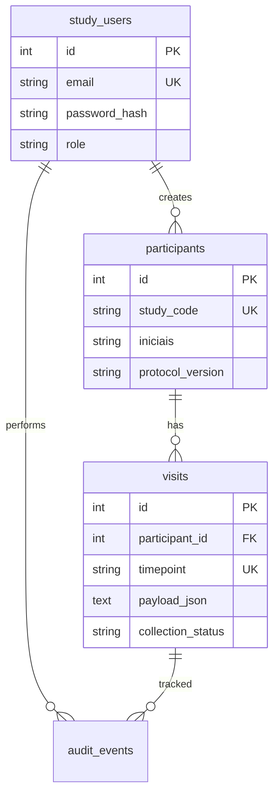

# Arquitetura — Linha Zero (estudo)

## Objetivo

Coleta estruturada, auditável e exportável para análise estatística e manuscrito (STROBE / protocolo CEP), sem misturar dados assistenciais do cadastro CIJ.

## Entidades

### `participants` (dados estáveis)

Identificação pseudonimizada e elegibilidade: código do estudo (`LZ-001`), iniciais, DN, cidade/UF, convênio, articulação-índice, status no estudo, data de inclusão, versão do protocolo.

Não armazenar nome completo, CPF, telefone ou prontuário SysLife.

### `visits` (dados por tempo)

Uma linha por participante + timepoint (`T0`, `T3`, `T6`, `T12`). O conteúdo clínico/laboratorial vai em `payload_json` (CRF congelado por `protocol_version`).

- **T0**: anamnese, menopausa basal, antropometria, queixa-índice, labs T0, plano inicial.
- **T3+**: campos de seguimento (definir no dicionário; payload pode ser subconjunto).

Estados: `draft` → `complete` → `locked` (bloqueado após conferência para análise).

### `audit_events`

Toda alteração relevante e login/exportação, para rastreabilidade em auditoria CEP.

## Autenticação

- E-mail + senha (bcrypt).
- Sessão HTTP-only cookie com JWT (mesmo padrão do cadastro-ci, secret próprio).
- 7 contas iniciais via `scripts/seed-coauthors.ts`.
- Primeiro login: `must_change_password = true` (trocar senha temporária).

## API (mínimo)

| Método | Rota | Quem |
|--------|------|------|
| POST | `/api/auth/login` | todos |
| POST | `/api/auth/logout` | todos |
| POST | `/api/auth/change-password` | autenticado |
| GET/POST | `/api/participants` | investigator+ |
| GET/PATCH | `/api/participants/:id` | investigator+ |
| GET/POST | `/api/participants/:id/visits` | investigator+ |
| PATCH | `/api/visits/:id` | investigator+ |
| POST | `/api/visits/:id/lock` | pi_admin, data_monitor |
| GET | `/api/export/csv` | data_monitor, pi_admin |

## Exportação para artigo

- **Wide**: 1 linha por participante (baseline T0 + último follow-up).
- **Long**: 1 linha por participante × visita × variável.
- Arquivos sem colunas identificáveis; apenas `study_code`.
- Gerar `data_dictionary.csv` a partir de `docs/DATA_DICTIONARY.md`.

## Deploy sugerido

- Repositório e domínio próprios (ex.: `linha-zero.seudominio.br`).
- Banco Postgres em produção; SQLite só em dev.
- HTTPS obrigatório; backup diário do banco.
- Plano B: export periódico + REDCap institucional quando o CEP exigir.
